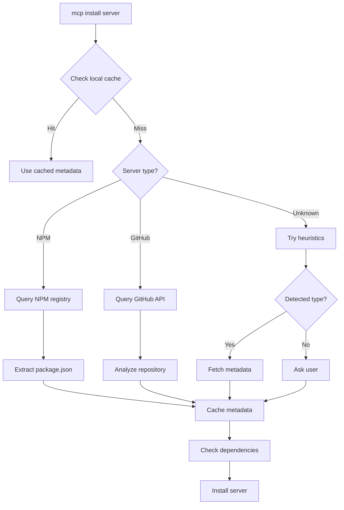

# MCP Server Dependency Detection

## Overview

To properly install and configure MCP servers, we need to determine their dependencies. This document outlines various strategies for detecting server requirements.

## Detection Strategies

### 1. Package.json Analysis (NPM Servers)

For NPM-based servers, we can fetch and analyze `package.json`:

```bash
# Fetch package.json from npm registry
curl https://registry.npmjs.org/@modelcontextprotocol/server-filesystem/latest | jq '.engines'
```

Example response:
```json
{
  "engines": {
    "node": ">=18.0.0"
  },
  "bin": {
    "mcp-server-filesystem": "./dist/index.js"
  },
  "mcp": {
    "type": "stdio",
    "runtime": "node",
    "requiredVersion": ">=18.0.0"
  }
}
```

### 2. MCP Server Metadata Standard

We should establish a standard for MCP servers to declare their dependencies:

```json
{
  "name": "@example/mcp-server",
  "mcp": {
    "type": "stdio",
    "runtime": "node",
    "version": "1.0.0",
    "requirements": {
      "node": ">=18.0.0",
      "python": null,
      "docker": null
    },
    "configuration": {
      "required": ["apiKey", "baseUrl"],
      "optional": ["timeout", "retries"]
    },
    "platforms": ["darwin", "linux", "win32"],
    "binary": {
      "darwin-arm64": "https://github.com/example/releases/download/v1.0.0/server-darwin-arm64",
      "darwin-x64": "https://github.com/example/releases/download/v1.0.0/server-darwin-x64",
      "linux-x64": "https://github.com/example/releases/download/v1.0.0/server-linux-x64",
      "win32-x64": "https://github.com/example/releases/download/v1.0.0/server-win32-x64.exe"
    }
  }
}
```

### 3. Server Registry/Database

Create a centralized registry with server metadata:

```json
{
  "servers": {
    "@modelcontextprotocol/server-filesystem": {
      "type": "npm",
      "runtime": "node",
      "minVersion": "18.0.0",
      "description": "File system access for MCP",
      "configuration": {
        "required": ["allowedDirectories"],
        "optional": []
      }
    },
    "rust-docs-mcp-server": {
      "type": "binary",
      "runtime": "native",
      "platforms": {
        "darwin-arm64": {
          "url": "https://github.com/Govcraft/rust-docs-mcp-server/releases/download/v1.0.0/rust-docs-server-aarch64-apple-darwin",
          "sha256": "abc123..."
        },
        "linux-x64": {
          "url": "https://github.com/Govcraft/rust-docs-mcp-server/releases/download/v1.0.0/rust-docs-server-x86_64-unknown-linux-gnu",
          "sha256": "def456..."
        }
      }
    },
    "mcp-server-fetch": {
      "type": "python",
      "runtime": "python",
      "minVersion": "3.10",
      "package": "mcp-server-fetch",
      "configuration": {
        "required": [],
        "optional": ["timeout"]
      }
    },
    "docker:postgrest/mcp-server": {
      "type": "docker",
      "runtime": "docker",
      "image": "postgrest/mcp-server:latest",
      "configuration": {
        "required": ["DATABASE_URL"],
        "optional": ["PORT"]
      }
    }
  }
}
```

### 4. GitHub Repository Analysis

For servers hosted on GitHub, we can analyze:

1. **Language detection** via GitHub API:
   ```bash
   curl https://api.github.com/repos/owner/repo | jq '.language'
   ```

2. **Release artifacts** for binaries:
   ```bash
   curl https://api.github.com/repos/owner/repo/releases/latest | jq '.assets'
   ```

3. **Common dependency files**:
   - `package.json` → Node.js
   - `requirements.txt`, `pyproject.toml`, `setup.py` → Python
   - `Cargo.toml` → Rust (likely binary)
   - `go.mod` → Go (likely binary)
   - `Dockerfile` → Docker option available

### 5. Heuristic Detection

When metadata isn't available, use naming patterns and heuristics:

```rust
fn detect_server_type(name: &str) -> ServerType {
    // NPM packages
    if name.starts_with('@') || name.contains('/') {
        return ServerType::Npm;
    }
    
    // Docker images
    if name.starts_with("docker:") {
        return ServerType::Docker;
    }
    
    // Python packages (common patterns)
    if name.starts_with("mcp-server-") || name.ends_with("-mcp") {
        // Check PyPI
        if check_pypi_package(name) {
            return ServerType::Python;
        }
    }
    
    // Check if it's a GitHub URL
    if name.contains("github.com") {
        return analyze_github_repo(name);
    }
    
    // Default to NPM (most common)
    ServerType::Npm
}
```

### 6. Runtime Probing

As a fallback, try to execute the server with version flags:

```rust
fn probe_runtime_requirements(server: &str) -> Option<Requirements> {
    // Try Node.js
    if let Ok(output) = Command::new("npx")
        .args(&["-y", server, "--version"])
        .output() {
        return Some(Requirements::Node);
    }
    
    // Try Python
    if let Ok(output) = Command::new("python")
        .args(&["-m", server, "--version"])
        .output() {
        return Some(Requirements::Python);
    }
    
    // Check if it's a binary
    if Path::new(server).exists() {
        return Some(Requirements::Binary);
    }
    
    None
}
```

## Implementation Plan

### 1. Primary Sources (In Order)

1. **Local cache** of known servers
2. **MCP metadata** in package.json
3. **Server registry** API
4. **NPM registry** API for npm packages
5. **GitHub API** for GitHub-hosted servers
6. **Heuristic detection** based on patterns
7. **Runtime probing** as last resort

### 2. Caching Strategy

```rust
struct ServerMetadataCache {
    cache_dir: PathBuf,
    ttl: Duration,
}

impl ServerMetadataCache {
    fn get(&self, server: &str) -> Option<ServerMetadata> {
        let cache_file = self.cache_dir.join(format!("{}.json", sanitize(server)));
        if cache_file.exists() {
            // Check TTL
            if is_fresh(&cache_file, self.ttl) {
                return read_metadata(&cache_file);
            }
        }
        None
    }
    
    fn set(&self, server: &str, metadata: &ServerMetadata) {
        let cache_file = self.cache_dir.join(format!("{}.json", sanitize(server)));
        write_metadata(&cache_file, metadata);
    }
}
```

### 3. Fallback Behavior

When dependency information isn't available:

```
$ mcp install unknown-server

⚠️  Unable to determine server requirements automatically.

What type of server is this?
1. Node.js/NPM package
2. Python package
3. Binary executable
4. Docker container
5. I'm not sure

Selection: _
```

### 4. User Override

Allow users to specify requirements manually:

```bash
# Force specific runtime
mcp install my-server --runtime=python --min-version=3.10

# Skip dependency checks
mcp install my-server --skip-deps

# Provide custom metadata
mcp install my-server --metadata=./my-server-meta.json
```

## Server Registry Specification

### Registry API Endpoints

```
GET /api/v1/servers                    # List all servers
GET /api/v1/servers/{name}            # Get specific server metadata
GET /api/v1/servers/{name}/versions   # Get all versions
GET /api/v1/search?q={query}          # Search servers
POST /api/v1/servers                  # Submit new server (authenticated)
```

### Registry Response Format

```json
{
  "name": "@modelcontextprotocol/server-filesystem",
  "latest": "1.0.0",
  "versions": {
    "1.0.0": {
      "runtime": "node",
      "minVersion": "18.0.0",
      "published": "2024-01-15T00:00:00Z",
      "downloads": 15234,
      "configuration": {
        "required": ["allowedDirectories"],
        "optional": ["readOnly"]
      }
    }
  },
  "description": "MCP server for file system access",
  "repository": "https://github.com/modelcontextprotocol/servers",
  "keywords": ["filesystem", "files", "directory"],
  "platforms": ["darwin", "linux", "win32"]
}
```

## Dependency Resolution Flow



## Examples

### NPM Server Detection

```bash
$ mcp install @modelcontextprotocol/server-filesystem

🔍 Detecting server requirements...
✓ Found NPM package
✓ Requires: Node.js >=18.0.0
✓ Configuration: allowedDirectories (required)
```

### Binary Server Detection

```bash
$ mcp install https://github.com/example/mcp-server

🔍 Analyzing GitHub repository...
✓ Language: Rust
✓ Found release binaries for:
  - macOS (ARM64, Intel)
  - Linux (x64)
  - Windows (x64)
✓ No runtime dependencies required
```

### Unknown Server

```bash
$ mcp install custom-internal-server

⚠️  Unable to determine server type automatically.

Checking common registries...
❌ Not found in NPM
❌ Not found in PyPI
❌ Not found in server registry

Please specify the server type:
1. Node.js/NPM package
2. Python package
3. Binary executable
4. Docker container

Selection: 2

Enter Python version requirement (e.g., >=3.10): >=3.8
Enter required configuration fields (comma-separated): api_key,endpoint
Enter optional configuration fields (comma-separated): timeout

✓ Server metadata saved for future use
```

## Future Enhancements

1. **Automatic metadata extraction** from server source code
2. **Community-maintained registry** with voting/ratings
3. **Dependency graph visualization** for complex servers
4. **Version compatibility matrix** for client-server pairs
5. **Security scanning** of dependencies
6. **Performance requirements** (CPU, RAM, disk)
7. **License detection** and compatibility checking